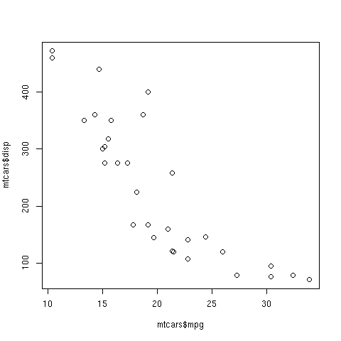
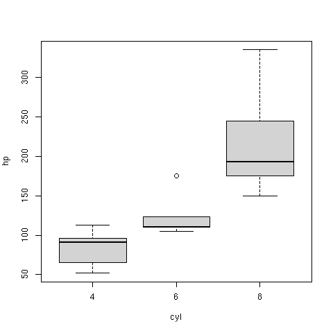
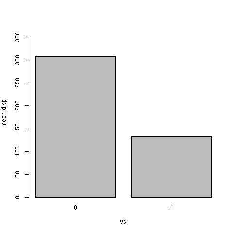
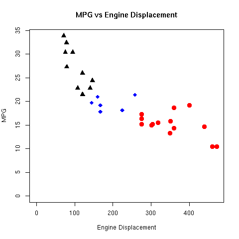
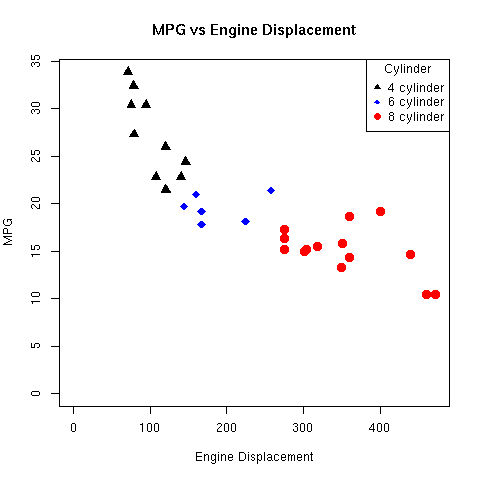
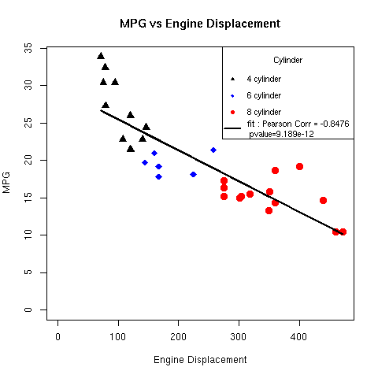
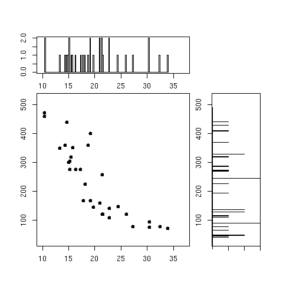

<!--
pandoc -f markdown answers.Rmd -o answers.pdf 
-->
---
title: "Answers to Informatics Challenge! 2022"
output: pdf_document
date: 2022-04-19
abstract: These are my answer's to the Informatics Challenge. I'm considering
          myself as an ADVANCED user.
---
<!--
header-includes:
  - \hypersetup{colorlinks=true,
            urlcolor=blue,
            pdfborderstyle={/S/U/W 1}}
- - -
\definecolor{codegray}{gray}{0.9}
\newcommand{\code}[1]{\colorbox{codegray}{\texttt{#1}}}

\maketitle
\tableofcontents
\pagebreak
```{r setup, include=FALSE}
knitr::opts_chunk$set(echo = TRUE)
```
-->

------------------------------------------------------------------------

## Are you submitting in the beginner or advanced category?
0. Advanced.

------------------------------------------------------------------------

# Beginner questions - 1 point per question

## --R-specific-- Data and variable types

1. Make a numeric vector at least three elements long
    a) Answer :
    
        ```{r}
        > a <- c(0,1,2)
        > is.vector(a)
        [1] TRUE
        ```
    
        $$\\[0.5in]$$

2. Make a named list object where the values are 10, 15, 20 and 25 and the
names of the elements are "Billy", "Eli", "Ali" and "Jordan"
    a) Answer :
    
        ```{r}
        > a <- list(10,15,20,25)
        > names(a) <- c("Billy", "Eli", "Ali", "Jordan")
        > is.list(a)
        [1] TRUE
        > names(a)
        [1] "Billy"  "Eli"    "Ali"    "Jordan"
        ```
    
        $$\\[0.5in]$$

3. Make a data frame where one column is random foods and the second column is
made-up calorie values
    a) Answer :
    
        ```{r}
        > df <- data.frame(c('ice cream','rice','thousand year egg'), c(1000,642,666), stringsAsFactors=FALSE)
        > colnames(df)<-c("food", "calories")
        > is.data.frame(df)
        [1] TRUE
        > df
                       food calories
        1         ice cream     1000
        2              rice      642
        3 thousand year egg      666
        ```
    
        $$\\[0.5in]$$


4. Add a new column of some sort to the data frame you made in question 3 and
assign the output a new variable
    a) Answer :
    
        ```{r}
        > df$flavor <- c('tasty','tasty','yuck')
        > dfnew <- df
        > dfnew
                       food calories flavor
        1         ice cream     1000  tasty
        2              rice      642  tasty
        3 thousand year egg      666   yuck
        ```
    
        $$\\[0.5in]$$


5. Remove the column you just added and assign this to a new variable
    a) Answer :
    
        ```{r}
        > dfnew2<-dfnew[1:2]
        > dfnew2
                       food calories
        1         ice cream     1000
        2              rice      642
        3 thousand year egg      666
        ```
    
        $$\\[0.5in]$$
    

## Make basic plots

If you want to use a language other than R, the data can be downloaded here: https://nationwidechildrens-my.sharepoint.com/:t:/g/personal/matthew_cannon_nationwidechildrens_org/EbYpZRiuizFOjd9nz4vKn38Br8z2hEKnRijltqbzsUgnow?e=pPnNxW

6. Using the mtcars data, make a scatterplot of displacement (disp) vs mpg
    a) Answer :
    
        ```{r}
        > plot(x=mtcars$mpg, y=mtcars$disp)
        ```
        {width=50%}
    
        $$\\[0.5in]$$
    


7. Using the mtcars data again, make a boxplot of hp separated by cyl
    a) Answer : 

        ```{r}
        > boxplot(hp ~ cyl, mtcars)
        ```
        {width=50%}
    
        $$\\[0.5in]$$
    
    
8. Using the mtcars data again, make a barplot of displacement (disp) for each
engine shape (column "vs")
    a) Answer : 

        ```{r}
        > gV = c(mean(mtcars[mtcars$vs==0,]$disp), mean(mtcars[mtcars$vs==1,]$disp))
        > barplot(gV, names=c("0","1"), axes=TRUE, ylim=c(0,max(gV)*1.2), ylab="mean disp", xlab="vs")
        ```
        {width=50%}
    
    
        $$\\[0.5in]$$


## Do a t-test

9. What is the *p*-value for a *t*-test (using the mtcars data), that tests if
displacement (disp) varies between engine shapes (column "vs")?
    a) Answer : 

        ```{r}
        > t.test(disp ~ vs, mtcars)[[3]]  # p-value = 2.476526e-06
        [1] 2.476526e-06
        ```
    
        $$\\[0.5in]$$
    
    
## Basic unix commands

10. Which command is used to create a new directory?
    a) Answer : 

        ```{bash}
        $ mkdir
        ```
    
        $$\\[0.5in]$$


11. Which command shows the size of a file?
    a) Answer : 

        ```{bash}
        $ du 
        ```
    
        $$\\[0.5in]$$


12. Which command lets you delete a file?
    a) Answer : 

        ```{bash}
        $ rm
        ```
    
        $$\\[0.5in]$$


13. Which command copies a file?
    a) Answer : 

        ```{bash}
        $ cp
        ```
    
        $$\\[0.5in]$$


14. Which command moves a file from one directory to another?
    a) Answer : 

        ```{r}
        $ mv
        ```
    
        $$\\[0.5in]$$


## Basic stats knowledge

15. Does a *t*-test assume that the measurements follow a normal distribution?
    a) Answer : 
        Yes
    
        $$\\[0.5in]$$
    
    
16. Briefly (1-2 sentences), what is the difference between parametric and
non-parametric tests?
    a) Answer : 
        Non-parametric does NOT assumes that the distribution follows a Gaussian. Parametric tests assume the underlying distribution follows a Gaussian.
    
        $$\\[0.5in]$$
    
    
17. Name one method to perform multiple testing correction
    a) Answer : 
        Bonferroni correction.
    
        $$\\[0.5in]$$
    
    
18. For a set of statistical tests, using a FDR cutoff of 0.1 will, in theory,
result in what percentage of false positives in your "significant" tests?
    a) Answer : 
        10%
    
        $$\\[0.5in]$$
    
    
## Basic file/data formats

19.  What file/data format is this?

```{verbatim, max.height='100px'}
>Sequence_1
AGTACATGGGGAGCTGGCGCAATGACGACCTAATTGGCGCACAGTACTAGGCATCGTCATCCAATGCGACGAGTCCTAC
ACTATCTTGGATATGATATGGCGCACTACACATGCTAGCCGCTGGGGAGATTAGCTCGAGTTGCCCCTTTGCCCGATCC
CGGAAGATACGCTCTAAGCTCGGCAATCGCTCTTGCCGTGCGAGATGCTAGCAAAAAGGTGTACTTCTCAGCGGAGCAG
AAAGATCATGTTTATTGGAAGCATCAACCTGCGCCGTCTTGTTAACTTGTCATATCGCGCACGTAGT
>Sequence_2
GCACTACACATGCTAGCCGCTGGGGAGATTAGCTCGAGTTGCCCCTTTGCCCGATCCCGGAAGATACGCTCTAAGCTCG
GCAATCGCTCTTGCCGTGCGAGATGCTAGCAA
```
    a) Answer : 
        fasta
    
        $$\\[0.5in]$$
    
    
20. What file/data format is this?

```{verbatim, max.height='100px'}
@A00498:77:HGHFVDRXX:1:2101:3775:1016 1:N:0:NACGGCTC
ANTTAGGCAACCGTGCTTATGGAAATGCA
+
F#FFFFFFFFFFFFFFFFFFFFFFF:FF,
@A00498:77:HGHFVDRXX:1:2101:3830:1016 1:N:0:NATCGCTC
TNGCTGCAGAATAACCCGGGCTCAGACTC
+
F#FFFFFFFF,FFFFFFFFFFFFFFFFF:
```
    a) Answer : 
        fastq
    
        $$\\[0.5in]$$
    
    
21. What file/data format is this?

```{}
chr1  213941196  213942363
chr1  213942363  213943530
chr1  213943530  213944697
chr2  158364697  158365864
chr2  158365864  158367031
chr3  127477031  127478198
```
    a) Answer : 
        A file showing the lengths of the chromosomes about the centromere (REVISIT).
    
        $$\\[0.5in]$$
    
    
22. What are the two main differences between a bam and sam file?
    a) Answer : 
        sam is ASCII text, bam is binary and compressed

        $$\\[0.5in]$$


------------------------------------------------------------------------

# Intermediate - 2 points per question

## Make fancy plots

23. Using the mtcars data, make a plot of mpg vs disp, coloring the points by
cyl. Include a title. Be sure the colors used are color-blind friendly.
    a) Answer : 

        ```{r}
        > cyl4 <- mtcars[mtcars$cyl == 4,]
        > cyl6 <- mtcars[mtcars$cyl == 6,]
        > cyl8 <- mtcars[mtcars$cyl == 8,]
        > plot(x=cyl4$disp, y=cyl4$mpg, main="MPG vs Engine Displacement", xlab="Engine Displacement", ylab="MPG", col=c("black"), pch=c(17), cex=c(1.5), xlim=c(0,max(mtcars$disp)), ylim=c(0, max(mtcars$mpg)))
        > points(x=cyl6$disp, y=cyl6$mpg, col="blue", pch=18, cex=1.5)
        > points(x=cyl8$disp, y=cyl8$mpg, col="red", pch=19, cex=1.5)
        ```
        {width=50%}

        $$\\[0.5in]$$


24. From the previous plot, include a legend for point colors and make the
title of the legend "Cylinder".
    a) Answer : 

        ```{r}
        # Adding code to above...
        > lab4 <- sprintf("4 cylinder")
        > lab6 <- sprintf("6 cylinder")
        > lab8 <- sprintf("8 cylinder")
        > legend("topright", c(lab4, lab6, lab8), pch=c(17,18,19), col=c("black","blue","red"),title="Cylinder")
        ```
        {width=50%}

    $$\\[0.5in]$$


25. Add a linear regression line to the plot along with text in the plot 
providing the Pearson's correlation and the *p*-value
    a) Answer : 
        ```{r}
        > cyl4 <- mtcars[mtcars$cyl == 4,]
        > cyl6 <- mtcars[mtcars$cyl == 6,]
        > cyl8 <- mtcars[mtcars$cyl == 8,]
        > plot(x=cyl4$disp, y=cyl4$mpg, main="MPG vs Engine Displacement", xlab="Engine Displacement", ylab="MPG", col=c("black"), pch=c(17), cex=c(1.5), xlim=c(0,max(mtcars$disp)), ylim=c(0, max(mtcars$mpg)))
        > points(x=cyl6$disp, y=cyl6$mpg, col="blue", pch=18, cex=1.5)
        > points(x=cyl8$disp, y=cyl8$mpg, col="red", pch=19, cex=1.5)
        > lab4 <- sprintf("4 cylinder")
        > lab6 <- sprintf("6 cylinder")
        > lab8 <- sprintf("8 cylinder")
        > 
        > mtfit <- lm(mpg ~ disp, mtcars)
        > df <- data.frame(mtcars$disp)
        > colnames(df)<-c("disp")
        > lines(df$disp, predict(mtfit,df), col="black", lty=1, lwd=3)
        > pearcor <- cor(data.frame(mtcars$disp,mtcars$mpg),method="pearson")[2,1]
        > pvalue <- t.test(df$disp,df$mpg)$p.value      # Wouldn't make sense any other way
        > labfit <- sprintf("fit : Pearson Corr = %.4f\n pvalue=%.3e",pearcor, pvalue)
        > legend("topright", c(lab4, lab6, lab8, labfit), pch=c(17,18,19,NA), lty=c(NA,NA,NA,1), lwd=c(NA,NA,NA,3), col=c("black","blue","red"),title="Cylinder", cex=c(0.9,0.9,0.9,0.9))
        ```

        {width=50%}

        <!--
        > ASIDE : t.test(df) is the same a t.test(c(df$disp,df$mpg)), it assumes that
          the alt. hyp is where the mean is 0.
        -->

        $$\\[0.5in]$$


## Align reads to a reference

26. On the Franklin cluster, in the folder /gpfs0/scratch/mvc002/ are two files:

  -   infoChallenge_R1.fastq.gz
  -   infoChallenge_R2.fastq.gz
  
  Align these reads to the hg38 reference using your aligner of choice and share
  your code.
  Several pre-made references are available here:
  `/reference/homo_sapiens/hg38/ucsc_assembly/illumina_download/Sequence/`.
    a) Answer : 
    ```{bash}
    $ ml load GCC/9.3.0 Bowtie2/2.4.1
    # Trim - no bonus points so I won't do it
    $ sbatch --wrap="bowtie2 --fr --threads=32 -x /reference/homo_sapiens/hg38/ucsc_assembly/illumina_download/Sequence/Bowtie2Index/genome -1 /gpfs0/scratch/mvc002/infoChallenge_1.fastq.gz -2 /gpfs0/scratch/mvc002/infoChallenge_2.fastq.gz -S data/infoChallenge.sam"
    ```

    $$\\[0.5in]$$


27. Share a screenshot of some of the aligned reads in IGV
    a) Answer : 
    ```{r}
    ```

    $$\\[0.5in]$$


28. Is this dataset whole genome sequencing, RNAseq, ChIPseq or amplicon seq?
    a) Answer : 
    ```{r}
    ```

    $$\\[0.5in]$$


## --R-specific-- Demonstrate the use of pipes and tidyverse functions

29. In R, starting with the mtcars dataset use `filter()` to remove any row
where cyl is "8" and then use `group_by()` to group the data by gear and then
use `summarize()` to calculate the average of the mpg column per group. This
should be in one continuous pipeline without intermediate variables or nested
functions. Use either pipe (`%>%` or `|>`).
    a) Answer : 
        ```{r}
        > library(dplyr)
        > mtcars %>% dplyr::filter(cyl != 8) %>% group_by(gear) %>% summarize(mean=mean(mpg))
        ```

    $$\\[0.5in]$$


## Write a bash loop

30. Write a "for loop" in bash to loop over the numbers 1-10 and print them to
the console
    a) Answer : 
        ```{bash}
        for((i=1; i<=10; i++)); do echo $i; done
        ```

    $$\\[0.5in]$$


## Git and GitHub

31. For your submission, put your results up into a public GitHub repository
and provide the link
    a) Answer : 
        ```{r}
        https://github.com/astrophys/Informatics_challenge_2022
        ```

    $$\\[0.5in]$$


32. Make sure your repo includes at least two branches and two commits
    a) Answer : 
        ```{bash}
        $ git checkout -b dev
        Switched to a new branch 'dev'
        log01: informatics_challenge_2022$ git branch
        * dev
          master
        log01: informatics_challenge_2022$ git log
        commit 1bb4fcaa7fe794a6f596faa090758c743d1a90c5 (HEAD -> dev, origin/master, master)
        Author: Ali Snedden <ali.snedden at nationwidechildrens.org>
        Date:   Wed Apr 20 15:31:18 2022 -0400
        
            Committed my answers from today
        
        commit f09ea9ad3d2b2b9b77b653ea4adeb8ff5c861b58
        Author: Ali Snedden <ali.snedden at nationwidechildrens.org>
        Date:   Tue Apr 19 15:43:12 2022 -0400
        
            answers.R, answers.Rmd :
            1. Answered up to question 22. Question 23 and 24 need fixed
        
        commit 753230aab633d8a39dfb0f5b434c71fe0b79a8a4
        Author: Ali Snedden <ali.snedden at nationwidechildrens.org>
        Date:   Tue Apr 19 13:35:16 2022 -0400
        
            answers.R, answers.Rmd :
            1. Got solutions upto and including question 8.
        
        commit a890d175e3fa8f633dfc7ebb4c9209dd1f10642c
        Author: Ali Snedden <ali.snedden at nationwidechildrens.org>
        Date:   Tue Apr 19 10:53:25 2022 -0400
        
            answers.R, answers.Rmd :
            1. Committed first attempts at answers
        
        commit 87d1b3055877918bb0127881d7109ba433f426dd
        Author: Ali Snedden <ali.snedden at nationwidechildrens.org>
        Date:   Tue Apr 19 09:05:27 2022 -0400
        
            Initial commit, before answers
        ```

    $$\\[0.5in]$$


------------------------------------------------------------------------

# Hard - 3 points per question

## Harder plotting

33. Add histograms to the top and right side of the mtcars mpg vs disp
scatterplot so that it looks like Figure 1. Note that the axes of each plot
should align.
    a) Answer : 

        ```{r}
        par(mar=c(1,1,1,1))
        # Central scatter plot
        par(fig=c(0.1,0.7,0.1,0.7))
        plot(mtcars$mpg, mtcars$disp, pch=c(16), xlim=c(10,37), ylim=c(30,520))
        # Right histogram
        par(fig=c(0.72,0.95,0.1,0.7), new=TRUE)
        tmp<-hist(mtcars$disp, breaks=seq(30,520,1), plot=FALSE)
        barplot(tmp$counts, axes=FALSE, space=0, horiz=TRUE, ylim=c(30,520))
        Axis(side=2, labels=TRUE, at=c(100,200,300,400,500))
        axis(side=1, tick=TRUE, at=c(1,2,3), labels=FALSE)
        box(col="black")
        # Top histogram
        par(fig=c(0.1,0.7,0.71,0.9), new=TRUE)
        hist(mtcars$mpg, main="", xlim=c(10,37), breaks=150)
        box(col="black")
        ```
        {width=50%}

    $$\\[0.5in]$$


## Get sequences from SRA

34. Using the command line, download the SRR10197556 dataset from the NCBI SRA
repository
    a) Answer : 
    ```{r}
    ```

    $$\\[0.5in]$$


## Bash variable expansion

35. Create a variable in bash containing the text "path/to/target/file.txt" and
then share code to trim off the path ("path/to/target/")
    a) Answer : 
    ```{r}
    ```

    $$\\[0.5in]$$


36. Create a variable in bash containing the text "path/to/target/file.txt" and
then share code to trim off the file extension (".txt")
    a) Answer : 
    ```{r}
    ```

    $$\\[0.5in]$$


## Grep

37. Use the Unix grep function to match the pattern "GATACA" in `/gpfs0/scratch/mvc002/infoChallenge_1.fastq.gz` on the Franklin cluster. How
many lines had a match?
    a) Answer : 
    ```{r}
    ```

    $$\\[0.5in]$$


## Write a program

38. Share code written in a language other than R or bash that reads in a fastq
file and trims 10 characters from the 3' end of the read and quality score
fields. You can use the `/gpfs0/scratch/mvc002/infoChallenge_1.fastq.gz` file to
test your code. 
    a) Answer : 
    ```{r}
    ```

    $$\\[0.5in]$$


------------------------------------------------------------------------

# Too hard - 4 points per question

## Finding a sequence in a fasta file?

39. How many times does sequence "GATTACA" appear in this fasta file? `/reference/homo_sapiens/hg38/ucsc_assembly/illumina_download/Sequence/WholeGenomeFasta/genome.fa`
    a) Answer : 
    ```{r}
    ```

    $$\\[0.5in]$$


## Using awk

40. Use this gtf file (`/reference/homo_sapiens/hg38/ucsc_assembly/illumina_download/Annotation/Genes/genes.gtf`)
and the Unix `awk` command to keep only the lines where first column is "chr11"
and the fourth column is greater than 100,000. How many lines are in the output?
    a) Answer : 
    ```{r}
    ```

    $$\\[0.5in]$$


------------------------------------------------------------------------

# I hate myself - 5 point per question

## Identify the mystery data type

41. On the Franklin cluster is a folder /gpfs0/scratch/mvc002/. Inside this
folder are two files:
  -   mysteryData_R1.fastq.gz
  -   mysteryData_R2.fastq.gz
  What kind of sequencing experiment are these data derived from?
    a) Answer : 
    ```{r}
    ```

    $$\\[0.5in]$$


42. What species do these reads come from?
    a) Answer : 
    ```{r}
    ```

    $$\\[0.5in]$$


## Harder programming

43. Share code that finds a specified sequence in a fasta file, which also
allows for ambiguous bases in the query
(https://droog.gs.washington.edu/parc/images/iupac.html)
    a) Answer : 
    ```{r}
    ```

    $$\\[0.5in]$$

